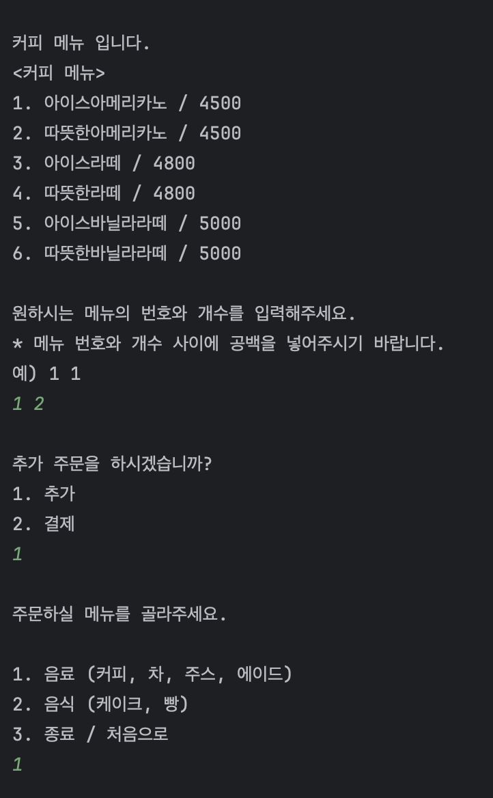

# 프로그램 설명

> 간단한 카페 키오스크 입니다.
주문을 입력하고, 주문을 확인할 수 있습니다.
>

# 클래스 설계

- Main : main 클래스. 키오스크를 실행하는 역할.
- Kiosk : 키오스크를 동작하는 클래스. 입출력을 담당한다.
   - getOrder() : 유저의 인풋을 받아 주문을 받는 메소드.
      - getDrinkOrder(), getFoodOrder() …
   - checkOrder()
   - 기타 메소드
- OrderManager : 주문을 관리하는 클래스. 인풋을 받아와서 주문을 만들고, 저장하고, 결제한다. 현재 결제는 기능 없음.
   - makeOrder(Menu menu) : 각 클래스의 주문을 받고, 세부 정보를 처리한다.
      - findNameByNumber(Menu menu), findPriceByNumber(Menu menu) : 메뉴 번호로 이름과 가격을 Order 객체에 저장한다.
      - checkOrderByNumber(int number) : 주문번호로 해당 Order 객체를 반환한다.
- MenuListMaker : 메뉴 리스트를 만드는 클래스. 단순 하드코딩이고, 메뉴를 보여주는 메소드도 담당한다.
   - makeMenuList() : 각 메뉴 리스트를 하드코딩으로 제작한다.
   - printMenu() : 각 메뉴 리스트를 출력한다.
   - ***getMenuListMaker() : 싱글톤 getter***
- Order : 주문 클래스. 주문에 대한 정보를 가지고 있다.
- Menu : 메뉴 클래스. 메뉴 번호, 이름, 가격을 변수로 가지고 있다.
   - ***toString() : 기본 출력 형식 추가***
- Drink : 메뉴를 상속한 음료 클래스.
   - ***샷추가를 위한 속성 추가 shots, defaultShots***
   - ***메소드 addShot(int shots) 추가***
   - ***toString() : 음료에 샷추가 한 경우 식별해서 출력 형식 변경***
- Coffee, Tea, Juice, Ade : Drink를 상속한 세부 음료 클래스.
   - ***Coffee 의 경우 우유를 위한 속성 추가***
   - ***메소드 getIsLatte(), setLatte(String milkType) 추가***
   - ***toString() - Coffee : 커피에서 라떼인 경우 우유 변경 출력 형식 변경***
- Food : 메뉴를 상속한 음식 클래스.
- Cake, Bread : Food를 상속한 세부 음식 클래스.
   - ***Bread 의 경우 데우기, 컷팅을 물어보기 위한 속성 및 setter 추가***
   - ***메소드 setNeedCut(), setNeedWarmUp() 추가***
   - ***toString() - Bread : 컷팅, 데우기에 따른 출력 형식 변경***
- Constants : 각종 숫자, 텍스트를 상수로 가지고 있는 클래스.


## 프로젝트 구성


- `Main` : 메인 클래스. 키오스크 실행.
- `Kiosk` : view 역할. 입출력 담당.
- Model
   - `Order` : 주문 내용을 담당하는 객체
   - `Menu` : 주문 메뉴 객체
      - `Drink` : 음료 객체. `Menu` 클래스 상속.
         - `Coffee` : 커피 객체. `Drink` 클래스 상속.
         - `Tea` : 차 객체. `Drink` 클래스 상속.
         - `Juice` : 주스 객체. `Drink` 클래스 상속.
         - `Ade` : 에이드 객체. `Drink` 클래스 상속.
      - `Food` : 음식 객체. `Menu` 클래스 상속
         - `Cake` : 케이크 객체. `Food` 클래스 상속.
         - `Bread`: 빵 객체. `Food` 클래스 상속.
- Controller
   - `MenuListMaker` : 메뉴 목록을 만들고, 출력하는 클래스
   - `OrderManager` : 주문에 대한 처리를 담당.
- constant
   - `Constants` : 상수 보관

## 클래스 설명

`Main.java`

```java
package kiosk;

public class Main {
    public static void main(String[] args) {
        Kiosk kiosk = new Kiosk();
        kiosk.run();
    }
}
```

`Kiosk.java`

```java
public class Kiosk {
    static Scanner sc;
    static OrderManager orderManager;
    static MenuListMaker menuListMaker;

    Kiosk() {
        sc = new Scanner(System.in);
        orderManager = new OrderManager();
        menuListMaker = new MenuListMaker();
    }
    
    void run(); // 키오스크 실행
    
    String getOrderOrCheck(); // 주문, 확인 선택 입력 받기
    
    void getOrder(); // 주문 받기
    
    void getMenuOrder(); // 각 메뉴 종류별 주문 받기
    
    boolean validateMenuInput(); // 메뉴 입력 시 검증
    
    void checkOrder(); // 주문 확인
    
    /*
	   *  기타 다른 메소드
     */
     
     // 피드백 후 추가된 메소드
     int askAddShot();
     
     String askChangeMilk();
     
     boolean askNeedCut();
     
     boolean askNeedWarmUp();
}
```

- ***askAddShot(), askChangeMilk() 메소드 추가.***
   - ***음료에 샷 추가, 커피 라떼 종류 우유 변경 추가.***
- ***askNeedCut(), askNeedWarmUp() 메소드 추가***
   - ***빵 데우기, 컷팅 여부 묻기 위함.***

`MenuListMaker.java`

```java
public class MenuListMaker {
    // 싱글톤 형식으로 변경
    private static MenuListMaker menuListMaker = new MenuListMaker();
    List<Coffee> coffeeList;
    List<Tea> teaList;
    List<Juice> juiceList;
    List<Ade> adeList;
    List<Cake> cakeList;
    List<Bread> breadList;
    
    public getter(); // getter
    
    private MenuListMaker(); // 생성자***
    
    public MenuListMaker getMenuListMaker(); // 싱글톤 객체 getter***
    
    void makeMenuList(); // 각 메뉴 리스트 만들기. 하드코딩.
    
    public void printMenu(); // 각 메뉴 리스트 출력하기.
    
    public boolean isCoffeeLatte(int menuNumber); // 메뉴넘버로 라떼인지 여부 반환.***
    
}
```

- ***싱글톤 구조 추가.***
   - ***추가이유***
      - ***메뉴를 만드는 객체는 한번만 불려져도 됨.***
      - ***여러 군데에서 객체를 부르다보니 새로 객체를 초기화 하는 상황이 생기고, 예상치 못한 오류가 발생.***
- ***isCoffeeLatte() 메소드 추가. 라떼 여부 파악해서 우유 변경여부 묻기 위함.***

`OrderMager.java`

```java
public class OrderManager {
    static List<Order> orderList = new ArrayList<>();
    Order order;

    public OrderManager() { // 생성자
        order = new Order(orderList.size());
    }
    
    public void makeOrder(Menu menu); // 각 종류별 메뉴 생성
    
    String findNameByNumber(Menu menu); // 메뉴 번호로 이름 찾아서 저장
    
    int findPriceByNumber(Menu menu); // 메뉴 번호로 가격 찾아서 저장
    
    public void charge(); // 결제
    
    public Order checkOrderByName(int number); // 주문 번호로 해당 Order 반환
    
    public Order getOrder(); // getter
    
}
```

`Menu.java`

```java
public class Menu {
    int menuNumber;
    String menuName;
    int price;
    int amount;
    
    public getter(); // getter
    
    public setter(); // setter   
    
    public String toString(); // 메뉴 출력***
}
```

- ***메뉴 출력 부분을 toString() 으로 관리***

`Drink.java`

```java
public class Drink extends Menu {
    int moreIce;
    int shots;
    int defaultShots;
    boolean isTogo;
    
    public String toString(); // 메뉴 출력***
}
```

- ***음료의 경우 샷 추가가 추가되면서, 샷 추가된 음료는 샷 추가 여부를 메뉴 결제시에 알려주기 위해 toString() 추가.***
- ***shots와 defaultShots를 비교하여 샷추가 여부 파악 후 출력***

`Coffee.java`

```java
public class Coffee extends Drink {
    boolean isLatte;
    String milk;
    MenuListMaker menuListMaker = MenuListMaker.getMenuListMaker();
		
		// 주문 받을 때 사용하는 생성자.
    public Coffee(int menuNumber, int amount) {
        super.menuNumber = menuNumber;
        super.amount = amount;
        super.shots = Constants.DEFAULT_SHOTS.getMsg();
        super.defaultShots = Constants.DEFAULT_SHOTS.getMsg();
        if(menuListMaker.isCoffeeLatte()) {
		        this.isLatte = true;
        } else {
		        this.isLattee = false;
        }
    }

		// 메뉴 리스트 만들 때 사용하는 생성자.
    public Coffee(int menuNumber, String menuName, int price) {
        super.menuNumber = menuNumber;
        super.menuName = menuName;
        super.price = price;
        if(isLatte) {
		        this.milk = Constants.MILK.getMsg();
        }
    }
    
    public boolean getIsLatte(); // 라떼인지 여부 반환
    
    public void setLatte(String milkInput); // 입력값에 따른 우유 종류 저장
    
    public String toString(); // 샷추가 여부, 우유 변경 여부에 따른 메뉴 출력 형식 반영
}
```

- ***isLatte, milk 추가***
- ***싱글톤 menuListMaker 사용***
- ***getIsLatte(), setLatte(), toString() 추가***

`Bread.java`

```java
public class Bread extends Food {
    boolean needCut;
    boolean needWarmUp;
    
    public Bread(int menuNumber, int amount) {
        super.menuNumber = menuNumber;
        super.amount = amount;
        this.needCut = false;
        this.needWarmUp = false;
    }

    public Bread(int menuNumber, String menuName, int price) {
        super.menuNumber = menuNumber;
        super.menuName = menuName;
        super.price = price;
        this.needWarmUp = false;
        this.needCut = false;
    }

    public void setNeedCut() {
        this.needCut = true;
    }

    public void setNeedWarmUp() {
        this.needWarmUp = true;
    }

    @Override
    public String toString(); // 컷팅여부, 데우기 여부에 따른 출력 형식 변경***
}
```

- ***needCut, needWarmUp 추가***
- ***setNeedCut(), setNeedWarmUp(), toString() 추가***

`Tea, Juice, Ade, Cake.java`

```java
public class Tea extends Drink {
		// 주문 받을 때 사용하는 생성자.
    public Coffee(int menuNumber, int amount) {
        super.menuNumber = menuNumber;
        super.amount = amount;
    }

		// 메뉴 리스트 만들 때 사용하는 생성자.
    public Tea(int menuNumber, String menuName, int price) {
        super.menuNumber = menuNumber;
        super.menuName = menuName;
        super.price = price;
    }
}
```

`Constants.java`

```java
public enum Constants {
    ZERO("0"),

    INPUT_ONE("1"),
    INPUT_TWO("2"),
    INPUT_THREE("3"),
    INPUT_FOUR("4"),

    DEFAULT_SHOTS("2"),

    DRINK("음료"),
    FOOD("음식"),
    COFFEE("커피"),
    TEA("차"),
    JUICE("주스"),
    ADE("에이드"),
    CAKE("케이크"),
    BREAD("빵"),

    MILK("우유"),
    LOWFAT_MILK("저지방우유"),
    SOY_MILK("두유"),
    OAT_MILK("귀리우유"),

    WRONG_INPUT_MSG("잘못된 입력입니다.");

    private final String msg;

    Constants(String msg) {
        this.msg = msg;
    }

    public String getMsg() {
        return this.msg;
    }
}

```

## 구현 결과

***샷, 우유 변경 추가 후***


***빵에 데우기, 컷팅 속성 추가***


이전 버전





# 간단한 스레드 구현
> 카페 키오스크 프로그램에서 스레드 기능을 추가했습니다.


## 타이머 기능

스레드로 타이머 기능 추가.

1. 미 입력 시간 타이머.

   키오스크를 사용할 때 입력하지 않는 시간이 1분이 초과되면 키오스크 사용이 종료됩니다.

2. 전체 이용시간 타이머.

   전체 이용 시간이 5분이 지나면 종료됩니다.


## 스레드 작동 과정

1. 키오스크가 시작되는 `Kiosk` 에서 `TimeChecker` 클래스의 `timerStart()` 메소드를 실행하여 타이머 기능을 작동합니다.
    - 코드

      `Kiosk.java`

        ```java
        
        public class Kiosk {
        	....
        	static InputManager inputManager;
        
        	Kiosk() {
        		...
        		inputManager = new InputManager();
        	}
        	
        	void run() {
        		timeChecker.timerStart();
        		....
        		
        	}
        }
        ```


2. `TimeChecker` class에서 `timerStart()` 메소드에서 `entireTimeChecker`, `noInputTimeChecker` 스레드가 실행됩니다.
    - 코드

      `TimeChecker.java`

        ```java
        package kiosk.util;
        
        public class TimeChecker {
            EntireTimeChecker entireTimeChecker;
            NoInputTimeChecker noInputTimeChecker;
        
            public TimeChecker() {
                // 전체 이용 제한 시간
                entireTimeChecker = EntireTimeChecker.getInstance();
                // 미입력 유지 시간
                noInputTimeChecker = NoInputTimeChecker.getInstance();
            }
        
            public void timerStart() {
                entireTimeChecker.start();
                noInputTimeChecker.start();
            }
        }
        ```


3. `EntireTimeChecker` 에서는 전체 이용 시간을 확인하고 5분이 지나면 시스템이 종료됩니다.
    - 코드

      `EntireTimeChecker.java`

        ```java
        package kiosk.util;
        
        public class EntireTimeChecker extends Thread {
            private static EntireTimeChecker entireTimeChecker = new EntireTimeChecker();
            private static long startTime;
            private static final long MAX_RUNTIME = 5 * 60 * 1000;
            private volatile boolean running = true;
        
            private EntireTimeChecker() {
                startTime = System.currentTimeMillis();
            }
        
            public static EntireTimeChecker getInstance() {
                return entireTimeChecker;
            }
        
            @Override
            public void run() {
                while(running) {
                    if(System.currentTimeMillis() - startTime >= MAX_RUNTIME) {
                        System.out.println("전체 사용 시간 5분이 초과되어 프로그램을 종료합니다.");
                        System.exit(0);
                    }
                    try {
                        Thread.sleep(1000);
                    } catch (InterruptedException e) {
                        Thread.currentThread().interrupt();
                    }
                }
            }
        
            public void stopTimer() {
                running = false;
            }
        }
        
        ```


4. `NoInputTimeChecker` 에서는 미입력 시간이 1분이 지나가면 시스템이 종료됩니다.
- 코드

  `NoInputTimeChecker.java`

    ```java
    package kiosk.util;
        
    public class NoInputTimeChecker extends Thread{
        long lastInputTime;
        private static final long NO_INPUT_TIME_OUT = 60 * 1000;
        private static NoInputTimeChecker noInputTimeChecker = new NoInputTimeChecker();
        private static final Object lock = new Object();
        
        private NoInputTimeChecker() {
            lastInputTime = System.currentTimeMillis();
        }
        
        public static NoInputTimeChecker getInstance() {
            if(noInputTimeChecker == null) {
                synchronized (lock) {
                    if(noInputTimeChecker == null) {
                        noInputTimeChecker = new NoInputTimeChecker();
                    }
                }
            }
            return noInputTimeChecker;
        }
        
        @Override
        public void run() {
            while (true) {
                if(System.currentTimeMillis() - lastInputTime >= NO_INPUT_TIME_OUT) {
                    System.out.println("1분 동안 입력이 없어 프로그램을 종료합니다.");
                    System.exit(0);
                }
                try {
                    Thread.sleep(1000);
                } catch (InterruptedException e) {
                    Thread.currentThread().interrupt();
                }
            }
        }
        
        public void resetTimer() {
            lastInputTime = System.currentTimeMillis();
        }
    }
        
    ```


4-1. 미입력 시간을 측정하기 위해서 기존 입력 부분을 수정하고, 입력을 관리하는 `InputManager`를 추가했습니다. 이곳에서 입력이 들어올때마다 `noInputTimeChecker` 에서 `resetTimer()` 메소드를 실행합니다.

- 코드
    
    `InputManager.java`
        
    ```java
        package kiosk.util;
        
        import java.util.Scanner;
        
        public class InputManager {
            Scanner sc;
            NoInputTimeChecker noInputTimeChecker = NoInputTimeChecker.getInstance();
        
            public InputManager() {
                sc = new Scanner(System.in);
            }
        
            public String getInput() {
                noInputTimeChecker.resetTimer();
                return sc.nextLine();
            }
        
            public int getInputInteger() {
                noInputTimeChecker.resetTimer();
                return Integer.parseInt(sc.nextLine());
            }
        }
    ```


### 결과 화면


# 스레드간 상호 작용

## 주문 상태 변경 기능

1. 주문이 완료되어서 `orderQueue`에 담기게 되면, `OrderProcessor` 스레드에서 그것을 받아서 처리합니다.
2. 주문에 포함된 메뉴의 개수에 따른 소요시간이 소요되고, 이 시간이 지난 후에 주문의 상태를 바꾸게 됩니다.
3. 주문의 상태를 읽고 있는 스레드인 `OrderReadyChecker` 는 이 상태가 바뀐 주문을 체크하고, 메뉴가 준비 되었다는 알림을 출력하게 됩니다.

## 스레드 작동 과정

1. 주문이 완료되면, `OrderManager` 에서 스레드에서 처리하는 `orderQueue`에 `Order` 객체를 담는다.
    - 코드

      `OrderManager.java`

      `OrderProcessor`, `OrderReadyChecker` 스레드를 실행해준다.

      `OrderManager` 에서 주문을 받을때 스레드를 시작하고, 스레드에 `BlockingQueue`를 할당하고 결제 처리를 하게되면 `orderQueue` 에 `Order` 를 추가하게 된다.

        ```java
        package kiosk.controller;
        
        public class OrderManager {
        		....
        		BlockingQueue<Order> orderQueue = new ArrayBlockingQueue<>(10);
        		OrderProcessor orderProcessor = new OrderProcessor(orderQueue);
        		OrderReadyChecker orderReadyChecker = new OrderReadyChecker(orderList);
        
        		public OrderManager() {
        				orderProcessor.start();
        				orderReadyChecker.start();
        		}
        		
        		// 결제하기
            public void charge() {
                // 결제 처리.
                orderList.add(order);
        
                try {
                    orderQueue.put(order);
                } catch (InterruptedException e) {
                    System.out.println("주문을 큐에 추가하는데 실패했습니다.");
                    Thread.currentThread().interrupt();
                }
        
                this.order = new Order(orderList.size());
            }
        }
        
        ```


2. `OrderProcessor` 에서는 orderQueue에 Order가 들어오게 되면 해당 주문에 대한 메뉴 개수에 맞는 시간이 흐른 뒤에 해당 주문의 상태를 변경합니다.
    - 코드

      `OrderProcessor.java`

      `order.setReadyOrder()` 메소드를 통해서 해당 `Order` 의 `isReady` 값을 변경해줍니다.

        ```java
        package kiosk.util;
        
        import kiosk.model.Order;
        
        import java.util.concurrent.BlockingQueue;
        
        public class OrderProcessor extends Thread {
            private BlockingQueue<Order> orderQueue;
        
            public OrderProcessor(BlockingQueue<Order> orderQueue) {
                this.orderQueue = orderQueue;
            }
        
            @Override
            public void run() {
                while(true) {
                    try {
                        Order order = orderQueue.take();
                        Thread.sleep(order.getMenuList().size() * 10 * 1000);
                        order.setReadyOrder();
                    } catch (InterruptedException e) {
                        System.out.println("Order processing thread interrupted.");
                        Thread.currentThread().interrupt();
                    }
                }
            }
        }
        
        ```

    - 결과 화면
      


3. `OrderReadyChecker` 스레드는 `orderList`를 보면서 주문이 완료된 시점에 주문이 완료되었다고 알려주는 스레드입니다.
    - 코드

      `OrderReadyChecker.java`

      `orderList`를 지켜보면서 `isGetReady()`가 바뀌면 준비가 됐다고 알려줍니다.

        ```java
        package kiosk.util;
        
        import kiosk.model.Order;
        
        import java.util.List;
        
        public class OrderReadyChecker extends Thread {
            private List<Order> orderList;
        
            public OrderReadyChecker(List<Order> orderList) {
                this.orderList = orderList;
            }
        
            @Override
            public synchronized void run() {
                try {
                    while (!Thread.currentThread().isInterrupted()) {
                        for(Order order : orderList) {
                            if(order.getIsGetReady() && !order.getIsNoti()) {
                                System.out.println();
                                System.out.println("-----------------------");
                                System.out.println("메뉴 준비가 다 되었습니다.");
                                System.out.println("주문 번호 : " + order.getOrderNumber());
                                System.out.println("메뉴를 픽업하러 와주세요.");
                                System.out.println("-----------------------");
                                System.out.println();
                                order.setNoti();
                            }
                        }
                        Thread.sleep(1000);
                    }
                } catch (InterruptedException e) {
                    Thread.currentThread().interrupt();
                }
            }
        }
        
        ```

    - 결과 화면

      
